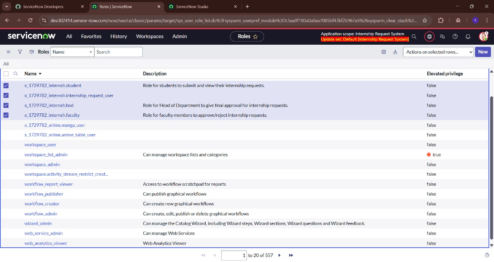
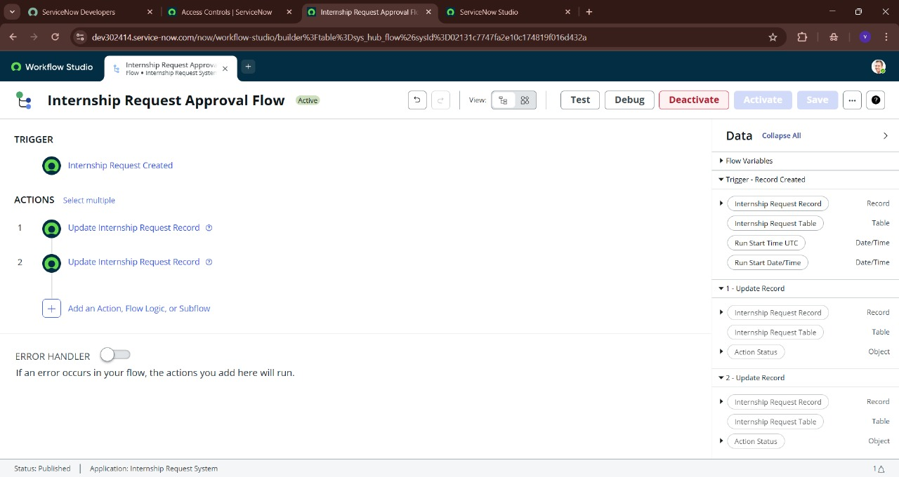
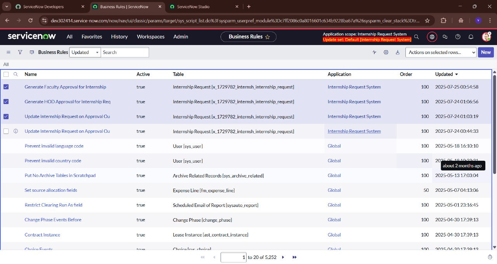
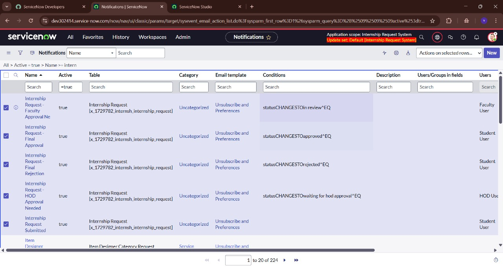
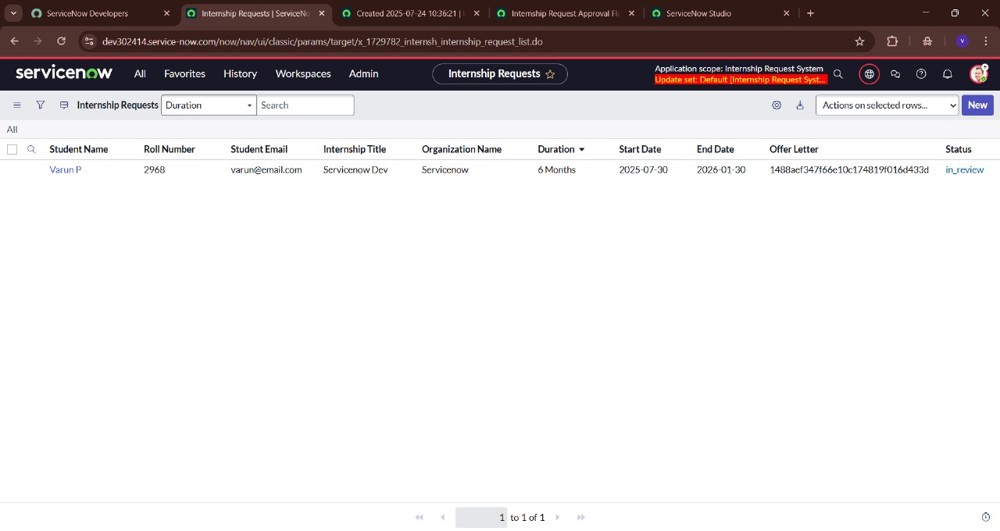
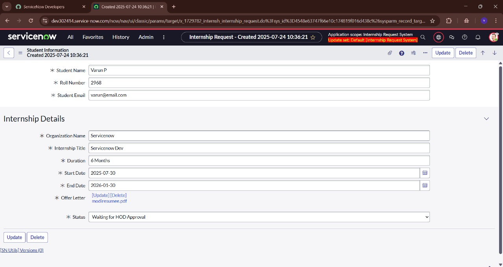
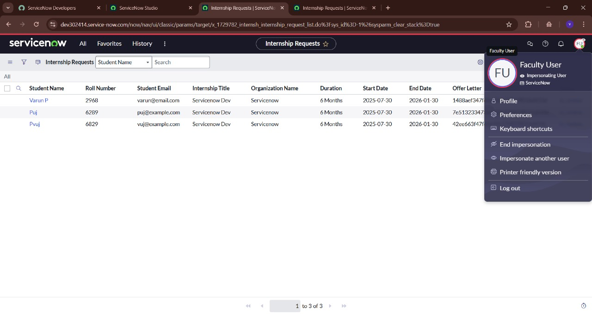
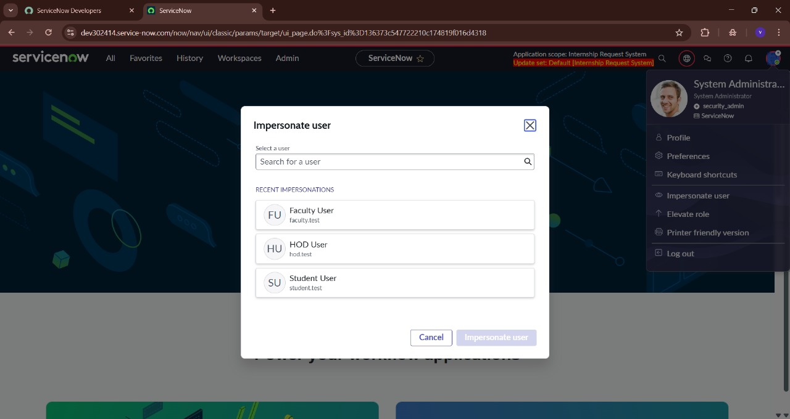

# ServiceNow-Internship-Approval-System
# Automated Internship & Project Request and Approval Workflow System (ServiceNow)

## Project Overview

This project focuses on designing and implementing an end-to-end automated workflow on the ServiceNow platform. The primary goal is to digitize and streamline the manual, paper-and-email-based process for students to submit internship or project requests, and for faculty and department heads to efficiently review and approve them. This solution enhances transparency, reduces manual effort, and provides real-time tracking of request statuses.

## Features Implemented

* **Custom Application Foundation:** Built a dedicated ServiceNow scoped application (`Internship Request System`) from scratch, including a custom table (`Internship Request`) with all necessary fields.
* **Role-Based Access Control (ACLs):** Configured granular security permissions for `Student`, `Faculty`, and `HOD` roles.
* **End-to-End Multi-Level Approval Workflow Automation:** Implemented a robust approval chain:
    * **Student Submission:** A user-friendly `Record Producer` (online form) allows students to submit requests.
    * **Initial Statusing:** Upon submission, a Business Rule automatically sets the request's status (`Submitted` → `In Review`).
    * **Faculty Approval Orchestration:** When status is `In Review`, a Business Rule is designed to automatically create an approval task for the Faculty Advisor.
    * **HOD Approval Orchestration:** Upon Faculty approval, another Business Rule updates the status to `Waiting for HOD Approval`, triggering a new approval task for the HOD.
    * **Dynamic Status Updates:** A central Business Rule dynamically manages request status updates (`Approved` or `Rejected`) based on actions taken by both Faculty and HOD on their respective approval tasks.
* **Automated Notifications (Configured):** Set up email notifications to alert all stakeholders at critical stages of the request lifecycle.

## Technologies & Skills Demonstrated

* **ServiceNow Platform:** Custom Application Development, System Administration.
* **ServiceNow Studio:** Application Scoping, Table & Field Management, Role & ACL Definition, Events.
* **Business Rules (Advanced Scripting):** Proficient use of server-side JavaScript scripting (GlideRecord API, `current` object, `gs.getUserIDByUserName()`, `gs.eventQueue()`, `gs.info()`) for complex workflow logic.
* **Flow Designer:** Utilized for initial workflow initiation.
* **Access Control Lists (ACLs):** Applied record-level and field-level security.
* **Notifications:** Configured event-driven email notifications.
* **Record Producers:** Designed user-friendly catalog items for data input.
* **Problem Solving & Debugging:** Developed strong troubleshooting skills by systematically debugging complex issues and implementing robust workarounds in a restricted sandbox environment.

## Project Demonstration & Visual Proof

This section showcases the key functionalities of the system through a sequence of screenshots.

#### I. Project Setup & Configuration (Backend)

1.  **ServiceNow Studio - Internship Request Table Definition**
    * Illustrates the custom application's foundation, showing the custom table and key fields defined in ServiceNow Studio.
    .jpg)
    (screenshots/ServiceNow Studio - Internship Request Application Details(Left pannel 2).jpg)
    (screenshots/ServiceNow Studio - Internship Request Application Details(Left pannel 3).jpg)

2.  **Roles Defined for Application**
    * Shows the custom `student`, `faculty`, and `hod` roles created for the application.
    

3.  **Custom Application Navigation (Filter Navigator)**
    * Demonstrates how the custom "Internship Request" modules appear in the Filter Navigator, providing access to the application's components.
    .jpg)

4.  **Flow Designer - Internship Request Approval Flow**
    * Shows the Flow Designer workflow, indicating its activation and the basic initial steps it performs.
    

5.  **Business Rules Orchestrating Workflow**
    * Highlights the Business Rules that handle the complex approval logic and status transitions.
    

6.  **Configured Email Notifications**
    * Displays the list of all custom email notifications set up for the project.
    

#### II. End-to-End Workflow Demonstration (Visual Proof)

7.  **Screenshot 1: The Submitted Request Form (Student's View)**
    * Captures the user-friendly `Record Producer` form, fully filled out before submission.
    .jpg)

8.  **Screenshot 2A: Status - In Review**
    * Shows the `Internship Request` record after submission, with its `Status` field correctly updated to `in_review`.
    

9.  **Screenshot 2B: Status - Waiting for HOD Approval**
    * Displays the `Internship Request` record after the Faculty approval step (manually progressed), with the `Status` correctly changed to `Waiting for HOD Approval`.
    

10. **Screenshot 2C: Status - Approved (Final)**
    * Shows the `Internship Request` record with the final `Status` as `Approved` (manually progressed), signifying the completion of the multi-level approval workflow.
    .jpg)

#### III. Supporting & Bonus Visuals

11. **Faculty's View of Internship Requests List**
    * Illustrates role-based access, showing how the `Faculty User` can see the list of submitted internship requests.
    

12. **Impersonate User Dialogue**
    * Useful for visually explaining how you switch user contexts (e.g., to Faculty or HOD) for testing and demonstration purposes.
    

---

## Challenges & Troubleshooting (Key Learning Points)

Developing this project in a personal developer instance presented unique configuration challenges. This experience significantly enhanced my debugging and problem-solving skills:

* **Flow Designer Limitations:** Faced restrictions where advanced Flow Designer actions (e.g., `Ask For Approval`, `Wait for Condition`) were unavailable. This necessitated pivoting the core approval orchestration to robust **Business Rule scripting**, providing deeper insight into ServiceNow's backend capabilities.
* **UI Visibility Issues:** Encountered scenarios where standard UI elements (e.g., User `home_page` field, "New" button on certain lists, "Approvers" related list) were not visible by default, requiring workarounds via direct URL access or form layout adjustments.
* **Notification and Email Debugging:** Troubleshot persistent issues with outbound email sending and event processing, requiring meticulous verification of system properties, event registry, and Business Rule event queuing. This reinforced systematic debugging methodologies.
* **Instance-Specific Behavior:** Adapted to and overcame several non-standard behaviors related to basic system functionalities, showcasing resilience and adaptability.

These experiences were invaluable in understanding how to adapt solutions in complex environments and effectively trace issues across different ServiceNow modules.

---
